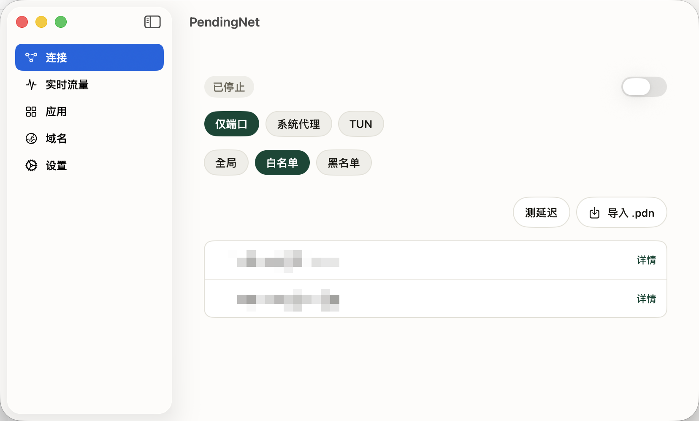

<p align="center">
  
</p>
<h1 align="center">PendingNet</h1>

<p align="center">
  配对一次，之后节点参数由服务端自己下发、自己轮换
  <br />
  <em>服务端的连接材料归服务端，客户端的策略归客户端，两边不再挤在同一份 JSON 里</em>
</p>

<p align="center">
  <a href="LICENSE"></a>
  
  
  
  
</p>

自建代理的一套自用客户端：一台 VPS 上跑 `pendingnet-server`，它生成一份一次性配对文件，
Mac 和 iPhone 导入之后就能连上，之后节点参数由服务端自己下发、自己轮换，不用再手工维护 sing-box 的 JSON 配置。

<p align="center">
  
</p>

> **这是一个人的实验项目，不是产品。**
>
> 作者自己每天在用，但没做过多人、多平台或长期运维的验证。别的网络环境、别的 VPS 供应商、
> 别的 macOS 版本都没试过。下面的「状态」一节写清了哪些部分真的跑通过、哪些只是代码在那儿。
>
> 界面和文档都是中文的。
>
> *(A personal experiment, not a product. Chinese-language UI and docs.
> Nothing here is hosted for you — you need your own VPS.)*

> 其余界面（实时流量、按应用统计、域名榜、设置）和 iOS 版的截图还没补，等补齐会放在 `docs/screenshots/`。

## 快速开始

**想直接用**

- **macOS** —— 从 [Releases](../../releases) 下 `PendingNet-0.3.28.zip`，已签名并经 Apple 公证。
  日常更新走的是自建的 Sparkle appcast，不走 GitHub。
- **iPhone / iPad** —— 只能走 TestFlight。0.3.28(328) 已上传，Apple 处理通过。

⚠️ **两个前提**：

1. **要有一台自己的 VPS**，并在上面跑起 `pendingnet-server`（见下面「跑起来」）。这份仓库不带任何现成的服务端。
2. **macOS 版还要求本机已经装了 `sing-box` 可执行文件**，位置得是 `/opt/homebrew/bin/sing-box`
   或 `/usr/local/bin/sing-box`（`brew install sing-box`）——特权助手要用它校验配置并由 launchd 拉起内核，
   找不到会直接报「找不到 sing-box 可执行文件」。iOS 版不需要，内核是编进 Packet Tunnel 的。

**想自己跑一遍代码**

```sh
go build ./cmd/pendingnet-server && go test ./...       # Go 1.26
cd app/SBTallyCore && swift test                        # Swift 6.3
```

## 文档

- [docs/design/](docs/design/) —— 设计文档，按时间排。想知道为什么这么设计看这里，特别是
  [统一设计](docs/design/2026-07-31-pendingnet-server-client-design.md)（产品边界、配对协议、配置归属）和
  [iOS 设计](docs/design/2026-08-07-pendingnet-ios-design.md)（隧道内的内存约束和 DNS 那个坑）。
- [docs/macos-updates.md](docs/macos-updates.md) —— macOS 的 Sparkle 更新链怎么发。
- [docs/ios-testflight.md](docs/ios-testflight.md) —— iOS 上 TestFlight 的完整流程。
- [docs/release.md](docs/release.md) —— 怎么出一个 GitHub Release。
- [docs/icloud-sync.md](docs/icloud-sync.md) —— iCloud 键值同步用到的 entitlement。

设计文档里有几份带着「历史文档，别照抄标识符」的抬头——2026-08-08 做过一次 bundle id 归一，
那些文档写在之前，标识符是旧的，正文原样保留。当前值以 `app/project.yml` 为准。

## 解决的是什么问题

自建代理的常见用法是：VPS 上跑个脚本，脚本吐出一份 sing-box / Clash 的完整配置，你把它复制到每台设备上。这套做法有三个一直烦人的地方：

1. **配置文件同时装着两类互不相干的东西。** 服务端的连接材料（Reality 公钥、Hysteria2 密码、端口）和客户端的策略（走不走 TUN、哪些域名直连、哪个 App 单独放行）挤在同一份 JSON 里。换服务端密钥要重下配置，重下配置就把本机策略冲掉了。
2. **换台设备要重来一遍。** 每台设备一份配置，服务端一改，所有设备一起手工同步。
3. **配置文件本身就是长期凭据。** 泄露一份，代理就归别人用了，而且没法单独吊销某台设备。

PendingNet 的做法是把这两类东西拆开：

- VPS 生成的 `.pdn` **不是** sing-box 配置。它只有 VPS 身份、控制端点、TLS 证书 SHA-256 指纹和一个短期一次性令牌，默认十分钟过期、用一次就作废。
- 导入成功后，客户端换到一个独立的长期设备令牌（存进 Keychain），之后通过控制 API 取当前的连接材料。服务端换密钥，客户端下次刷新就跟上，不用你做任何事。
- 路由模式、规则集、TUN / 系统代理的选择**始终由客户端保存**，服务端下发的东西碰不到它们。这条在代码里是有测试守着的——每个配置生成的测试都带一条断言，确认服务端返回的数据影响不了客户端策略。

## 主要功能

| | 状态 |
| --- | --- |
| **VPS 端**（Go） | 全新部署：下载并校验官方 Xray / Hysteria2 Release，生成 Reality / Hysteria2 密钥与证书，写 systemd 服务并启动。也能接管已有的 `singbox-script-for-vps` 部署（读它的 env 文件迁移节点资料，不执行任何 shell 文件）。Debian 12 amd64 上跑通过真实流量。 |
| **macOS 客户端**（SwiftUI） | 导入或双击 `.pdn` 配对；三种接管方式（仅端口 / 系统代理 / TUN）；三档路由（全局 / 白名单 / 黑名单）；协议在 Reality 与 Hysteria2 之间切换、可测延迟；按应用和按域名的流量统计；Sparkle 2 自动更新（Developer ID 签名 + 公证 + EdDSA 签名 appcast）。当前 0.3.28。 |
| **iOS 客户端**（SwiftUI + Network Extension） | 内嵌 sing-box libbox 内核的 Packet Tunnel Extension，配对、启停隧道、协议选择、三档路由。0.3.28(328) 已上传 TestFlight，Apple 处理通过。 |
| **本机统计**（Go，项目最早的部分） | `sbtally` 从 sing-box 的 Clash API 订阅连接流，按 (应用, 域名) 累计流量写进 SQLite，提供本地 JSON / SSE 接口和一个命令行报表。 |

## 架构

一条配对通道，一条代理通道，两条互不相干。

```
  Mac / iPhone                       VPS（Debian 12 amd64）
 ┌────────────────────┐              ┌────────────────────────┐
 │ SwiftUI 客户端     │  .pdn 一次性 │ pendingnet-server      │
 │ 策略留在本机       │ ──────────►  │ TCP/7443 控制 API      │
 │ 设备令牌进 Keychain│ ◄──────────  │ 按需下发连接材料       │
 └────────────────────┘ 长期设备令牌 └────────────────────────┘
           │                              │ systemd 托管
           │ 代理流量                     ▼
           │                         ┌────────────────────────┐
           └────────────────────────►│ xray-core   TCP/443    │
                                     │ hysteria2   UDP/443    │
                                     └────────────────────────┘
```

- **配对通道**只信任 `.pdn` 里钉死的那个服务端证书指纹，是一条独立直连，既不依赖也不改写系统里已有的代理。
- **客户端策略**（路由模式、规则集、TUN / 系统代理）永远由客户端保存，控制 API 返回的数据碰不到它们。
- **macOS 的内核不在 app 里** —— 是本机装的 `sing-box`，由特权助手（root，按代码签名校验 XPC 调用方）
  写配置、校验、交给 launchd 拉起。**iOS 相反**，内核是编进 Packet Tunnel Extension 的 libbox。
- **能抽成纯函数的逻辑都在 `app/SBTallyCore`**，两端共用，全部 Swift 测试也在那儿。

## 状态：能用到什么程度

这一节是认真写的，不是免责声明：

- **arm64 VPS 没验证过。** 下载和校验的 arm64 分支代码里有（`internal/pnserver/release.go`），但从没在真的 arm64 机器上跑过。
- **iOS 隧道没做过真机长跑验收。** 代码是完整的，TestFlight 构建 Apple 那边也过了，但设计文档里定的验收线（承载流量 10 分钟后常驻内存 < 40MB、goroutine 数不单调增长）没有留下跑过的记录，所以这里不打勾。
- **升级、凭据轮换、卸载、完整回滚**这几条 VPS 生命周期命令还没补齐。现在只有安装、部署、接管、查状态。
- **没有设备管理。** 配对之后没法列出、吊销或轮换某台设备的令牌。
- **多 VPS 的支持是半截的**：能存多台、能切换，但没有自动选路或故障转移。
- **没有 CI。** 测试都能在本机一条命令跑完（见下），但没有 GitHub Actions 在跑它们。
- **GitHub Release 只有一个**（0.3.28，只带 macOS 的 `.zip`）。日常更新仍然走自建的 Sparkle appcast，不走 GitHub；怎么再出一个见 [docs/release.md](docs/release.md)。
- **只在作者自己的机器和 VPS 上用过。** 别的网络环境、别的 VPS 供应商、别的 macOS 版本都没试过。

### 测试

49 个测试文件，272 个用例。最近一次实测（**2026-08-22**，macOS 26 / Apple Silicon）：

| | 用例 | 通过 | 跳过 | 失败 |
| --- | --- | --- | --- | --- |
| Go（`go test ./...`，10 个包） | 72 | 70 | 2 | 0 |
| Swift（`swift test`） | 200 | 199 | 1 | 0 |

跳过的三个都是要外部东西才能跑的，不是坏掉的测试：

- 两个 Go 用例校验生成出来的 Xray / Hysteria2 配置能不能被真的引擎接受，要本机装了那两个二进制并用 `PENDINGNET_XRAY_BIN` / `PENDINGNET_HYSTERIA_BIN` 指过去。
- 一个 Swift 用例是端到端联机配对，要一份现生成的 `.pdn` 和一个 sing-box 可执行文件：

```sh
PENDINGNET_LIVE_PAIRING_FILE=/tmp/test.pdn \
PENDINGNET_LIVE_SING_BOX=/path/to/sing-box \
swift test --filter PendingNetPairingTests/testLivePendingNetServerWhenPairingFileIsProvided
```

macOS / iOS app 本身没有 UI 测试——能抽成纯函数的逻辑都放进了 `SBTallyCore` 用 `swift test` 覆盖，界面部分靠手工验证。

## 跑起来

### 一、VPS 端

需要一台 Debian 12 amd64 的 VPS。先在本机交叉编译再上传：

```sh
GOOS=linux GOARCH=amd64 go build -o pendingnet-server ./cmd/pendingnet-server
scp pendingnet-server root@<你的VPS>:/root/
```

全新部署：

```sh
sudo ./pendingnet-server install \
  --name "My VPS" \
  --endpoint "https://203.0.113.10:7443"

sudo pendingnet-server provision \
  --server-ip "203.0.113.10" \
  --reality-sni "www.cloudflare.com"

sudo pendingnet-server pair create --out /root/my-vps.pdn
sudo pendingnet-server status
```

默认 TCP/443 跑 Reality、UDP/443 跑 Hysteria2、TCP/7443 跑控制服务。**这三个入口要自己在防火墙和云厂商安全组里放行**——`provision` 不会替你改防火墙。

（上面的 `203.0.113.10` 是 RFC 5737 的文档保留地址，换成你自己的。）

### 二、接管已有的 sing-box 部署

已经在跑 `singbox-script-for-vps` 的话，可以只接管控制面，代理服务原样不动：

```sh
sudo ./pendingnet-server install --name "My VPS" --endpoint "https://203.0.113.10:7443"
sudo pendingnet-server import-singb
sudo pendingnet-server pair create --out /root/my-vps.pdn
```

`import-singb` 读现有的 `/etc/singb/config.env` 和 `/etc/singb/state.env`，只取客户端连接需要的字段，不导入 Xray 私钥、完整服务端配置或任何路由规则，也不执行那些 shell 文件。这一步只新增 TCP/7443。

确认没有客户端还在用旧服务之后，才可以让 PendingNet 生成新凭据、接管 TCP/443 和 UDP/443：

```sh
sudo pendingnet-server provision \
  --server-ip "203.0.113.10" \
  --reality-sni "www.cloudflare.com" \
  --replace-existing \
  --skip-download
```

| | 只接管控制面 | 完全接管 |
| --- | --- | --- |
| TCP/443、UDP/443 | 原有 `xray.service` / `hysteria-server.service` | `pendingnet-xray.service` / `pendingnet-hysteria.service` |
| 连接密钥 | 沿用旧服务已有的 | PendingNet 重新生成 |
| 对旧客户端 | 不受影响 | **立即失效，需要重新配置** |

**只接管控制面是一个可以长期停在这里的终态**，不是必经的中间步骤——两种终态在客户端看来完全一样。完全接管会让还在用旧节点的设备立刻断线且密钥不可回滚，拿不准就停在上一步。

切换过程会先验证新配置；启动失败时会尝试把原来的 `xray.service` / `hysteria-server.service` 拉回来，旧配置不删。`--replace-existing` 必须配 `--skip-download`（接管时沿用机器上已验证过的二进制），否则命令直接报错退出。

### 三、客户端

把 `/root/my-vps.pdn` 安全地传到 Mac 或 iPhone 上导入。文件十分钟过期、只能用一次，**每台设备单独生成一份**。

macOS 上双击 `.pdn` 就能导入。配对和取节点走的是一条独立的直连通道，只信任 `.pdn` 里钉死的那个服务端证书指纹，既不依赖也不改写系统里已有的代理。

### 四、从源码构建

需要 Go 1.26、Xcode（Swift 6.3）、[XcodeGen](https://github.com/yonaskolb/XcodeGen)。

```sh
# Go：服务端 + 统计 CLI
go build ./cmd/pendingnet-server
go build ./cmd/sbtally
go test ./...

# Swift：共享核心逻辑
cd app/SBTallyCore && swift test && cd ../..

# macOS / iOS app
cd app
xcodegen generate
xcodebuild -project PendingNet.xcodeproj -scheme PendingNet build
xcodebuild -project PendingNet.xcodeproj -scheme PendingNetIOS \
  -sdk iphonesimulator -destination 'generic/platform=iOS Simulator' build
```

iOS 的 Packet Tunnel 要链接 `app/Vendor/Libbox.xcframework`（约 358 MB，不进版本库）。用 `scripts/build-libbox-xcframework.sh` 自己构建一份。

## 下载

**[Releases](../../releases) 里只有 macOS 版（`.zip`，已签名并经 Apple 公证）。iOS 版不在，也不可能在。**

Apple 不允许在 App Store / TestFlight 之外分发 iOS 应用。想在 iPhone 上跑，只有两条：
用自己的开发者账号从 Xcode 装到自己的设备，或者走 TestFlight。

macOS 装上之后的日常更新走自建的 Sparkle appcast，不再经过 GitHub。

## 仓库结构

```
cmd/pendingnet-server/   VPS 端：安装、部署、接管、配对、状态
cmd/sbtally/             本机统计的命令行
internal/pnserver/       服务端核心：状态、HTTP API、Release 下载校验、systemd
internal/pairing/        .pdn 的生成与严格校验
internal/source/         Clash API 的 WebSocket 连接流订阅
internal/core/           流量累加、SQLite 存储、查询
internal/daemon/         统计守护进程 + 本地 HTTP/SSE 接口
internal/sbconfig/       sing-box 配置的导入与生成
app/SBTallyCore/         Swift 共享层（模型、配置生成、Keychain、控制协议）+ 全部 Swift 测试
app/SBTally/             macOS app
app/PendingNetHelper/    macOS 特权助手（root，按代码签名校验 XPC 调用方）
app/PendingNetIOS/       iOS app
app/PacketTunnel/        iOS Packet Tunnel Extension（内嵌 libbox）
scripts/                 构建、签名、公证、发布、App Store Connect 查询
deploy/                  本机 launchd 部署脚本（早期的自用统计服务）
```

**技术栈**：Go 1.26（`modernc.org/sqlite` 纯 Go 实现，不用 cgo；`github.com/coder/websocket`）·
Swift 6 / SwiftUI · NetworkExtension · sing-box libbox · XcodeGen · Sparkle 2 · systemd · Xray-core · Hysteria2

## 参与

这是个人实验项目，issue 和 PR 都欢迎，但作者不保证响应速度，也不承诺路线。

安全问题请私下联系，别开公开 issue——这个项目的代码直接管着代理流量和凭据。

## 许可

[MIT](LICENSE)。

第三方运行时 / 库：sing-box · Xray-core · Hysteria2 · Sparkle 2 · `modernc.org/sqlite` 等，各遵其原协议。

---

<sub>本 README 全文由 Claude 撰写。其中的版本号、测试用例数与通过/跳过情况来自 2026-08-22 在
macOS 26 / Apple Silicon 上实跑 `go test ./...` 与 `swift test` 的输出，
「跑起来」「架构」两节的结论来自代码核对，不是从旧文档转抄。</sub>
